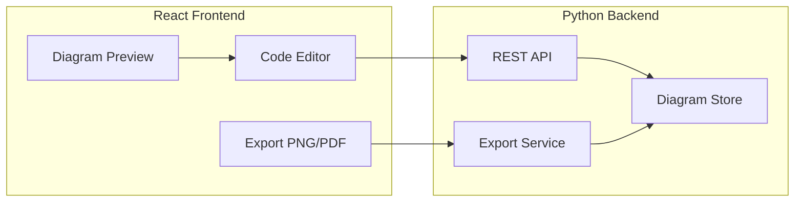

# Architecture

## Overview

mmdGenerator is a monorepo with a React frontend and a Python (FastAPI) backend. The frontend provides a split-pane UI: code editor (left) and Mermaid diagram preview (right). Diagrams are stored on the server (one `.mmd` content per diagram). Export (PNG/PDF) is done by sending the current SVG to the backend, which uses CairoSVG to produce high-resolution output.

## Components

- **Frontend**: Vite + React + TypeScript, Material UI, Mermaid.js for rendering, i18next (DE/EN). Communicates with the backend over REST.
- **Backend**: FastAPI; SQLite for diagram metadata and content; CairoSVG for SVG → PNG/PDF. Logging uses a rotating file handler (max 40 MB).
- **Deployment**: Single Docker image (frontend built at image build time and served as static files by the backend). Multi-arch (amd64, arm64) for GHCR; Raspberry Pi 5 runs the arm64 image.

## Data flow

- List/create/get/update/delete diagrams via `/api/diagrams`.
- Export: frontend gets SVG from Mermaid render, POSTs to `/api/export/png` or `/api/export/pdf` with scale (PNG); backend returns binary file.

See [Deployment](deployment.md) for Docker and GitHub Actions.
